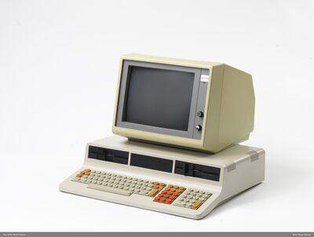
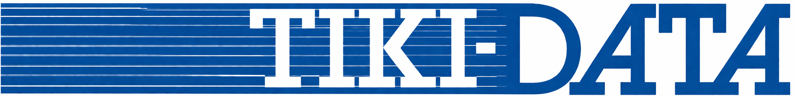

# TIKI-100 Emulator

[](https://github.com/HackerCorpLabs/tiki100/actions/workflows/release.yml)
[](https://github.com/HackerCorpLabs/tiki100/releases/latest)


Cross-platform hardware emulator for the **TIKI-100**, a Norwegian CP/M-compatible computer from 1984. Period-accurate Z80A at 4 MHz, AY-3-8912 sound, FD1771 floppy and WD1010 hard disk controllers, plus full Z80 DART serial with Hayes-modem-over-TCP support.

Based on the original emulator by Asbjorn Djupdal (2000–2001) and Z80 CPU code by Marat Fayzullin, restructured around an SDL2 cross-platform frontend.

<p align="center">
  <br>
  
</p>

## New to the emulator?

Start with one of these introductions — no prior emulator or retro-computing experience required.

- **[Illustrated Intro (PDF, 19 pages)](docs/Intro.pdf)** — A friendly, illustrated walkthrough of the TIKI-100 Emulator: from install to first boot, the F12 menu, keyboard mapping, and running 1984 software.
- **[User Manual (Markdown)](docs/MANUAL.md)** — Comprehensive reference: installation, every F12 menu control, keyboard, troubleshooting, FAQ, glossary.
- **[User Manual (PDF)](docs/MANUAL.pdf)** — Same content as the Markdown manual, ready to print or read offline.

## Quick start

**Pre-built binaries** for macOS, Linux, Windows, and Raspberry Pi are on the [Releases page](../../releases). One-line install on Debian/Ubuntu/Raspberry Pi OS:

```bash
curl -fsSL https://raw.githubusercontent.com/HackerCorpLabs/tiki100/main/scripts/install.sh | sh
tiki100 -fd0 /usr/share/tiki100/disks/boot/tiko_kjerne_v4.01.dsk
```

**Build from source on Linux** (full instructions in [docs/BUILDING.md](docs/BUILDING.md)):

```bash
sudo apt install build-essential cmake pkg-config libsdl2-dev zenity
git clone https://github.com/HackerCorpLabs/tiki100.git
cd tiki100 && make release
./build_release/bin/tiki100 -fd0 disks/boot/tiko_kjerne_v4.01.dsk
```

## Hardware emulated

| Component | Chip | Notes |
|-----------|------|-------|
| CPU | Zilog Z80A | 4 MHz |
| RAM | | 64 KB main + 32 KB video |
| ROM | | 8 KB monitor |
| Video | Discrete TTL | 1024×256 (2 col), 512×256 (4 col), 256×256 (16 col) |
| Sound | AY-3-8912 | 3 tone + noise + envelope, SDL2 audio |
| Floppy | FD1771 | 2 drives, 90K–800K images |
| Hard Disk | WD1010 | 2 × 8 MB, 512-byte sectors |
| Serial | Z80 DART | Dual async ports + Hayes/TCP modem |
| Parallel | Z80 PIO | Printer port |
| Timer | Z80 CTC | 4-channel counter/timer |

Full I/O port map and source-tree layout: [docs/HARDWARE.md](docs/HARDWARE.md).

## Documentation

- **[User manual](docs/MANUAL.md)** — beginner-friendly walkthrough: installing, booting, mounting disks, keyboard, troubleshooting, FAQ, glossary
- **[Install pre-built binaries](docs/INSTALL.md)** — macOS, Linux/RPi (`.deb`), Windows
- **[Build from source](docs/BUILDING.md)** — every supported platform
- **[Runtime usage](docs/USAGE.md)** — CLI flags, keyboard mapping, status LEDs
- **[Configuration overlay (F12 menu)](docs/MENU.md)** — CPU speed, volume, ROM, floppy/HD mounting, serial setup
- **[Serial ports & AT modem](docs/SERIAL.md)** — TCP serial modes, Hayes commands, BBS dialing
- **[Hardware reference](docs/HARDWARE.md)** — I/O port map, project structure
- **[Credits & licenses](docs/CREDITS.md)** — attribution for upstream code
- **[Apple code signing](docs/apple-dev.md)** — notes on signing/notarizing macOS builds

## About the TIKI-100

The TIKI-100 was launched by **Tiki Data A/S** in Oslo in 1984, founded the previous year by Lars Monrad-Krohn and Gro Jørgensen — both alumni of Mycron. It was developed for a Norwegian public tender for ~300 (potentially several thousand) school computers, where it competed against Sweden's Luxor, Britain's BBC Micro, and the American Osborne and Apple. Tiki-Data won a major contract.

Originally released as the *Kontiki 100*, the name was changed in 1984 after a dispute with explorer Thor Heyerdahl. The hardware ran TIKO/KP/M — backwards-compatible with Digital Research's CP/M, so it could run WordStar, SuperCalc, and thousands of other CP/M programs alongside its native software (BRUM, Tiki-Kalk, TIKI-BAS). It could also read floppies from Scandis, IBM-PC, Osborne, and ABC-800. Built in five variants distinguished by floppy configuration; chassis was usually grey, occasionally red or yellow.

> Text and images in the *About* section are from [Norsk Teknisk Museum](https://digitaltmuseum.no/011024239095/datamaskin), translated from Norwegian.

## Contributing

Issues and pull requests are welcome. There is no automated test suite — validation is manual via ROM/disk images.
