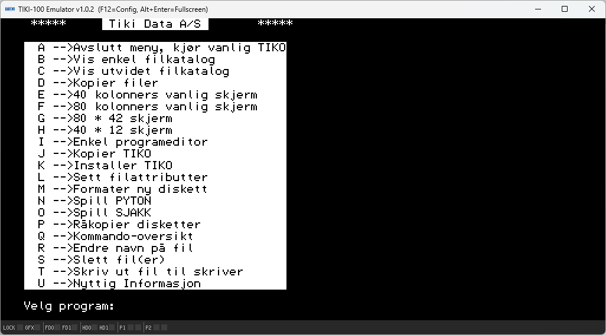
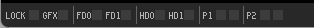
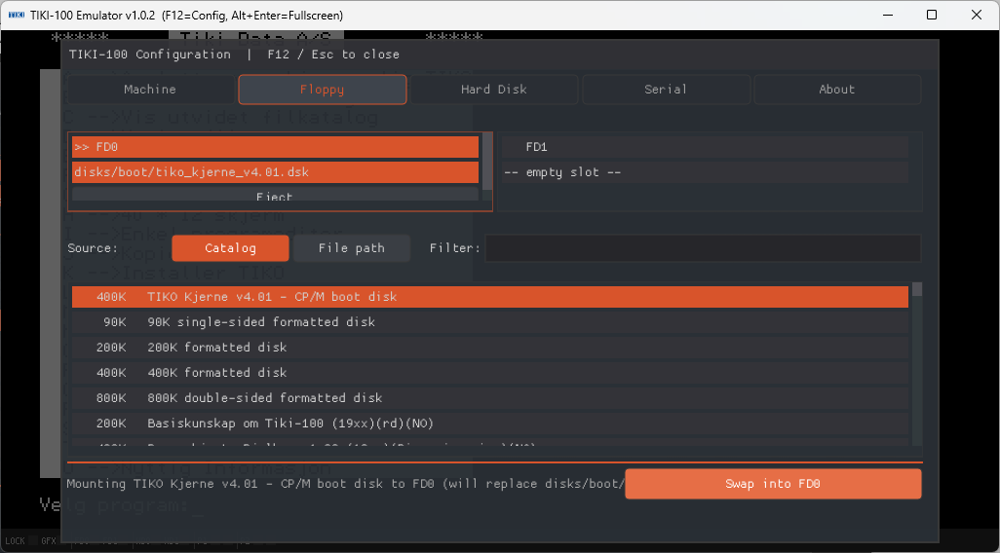
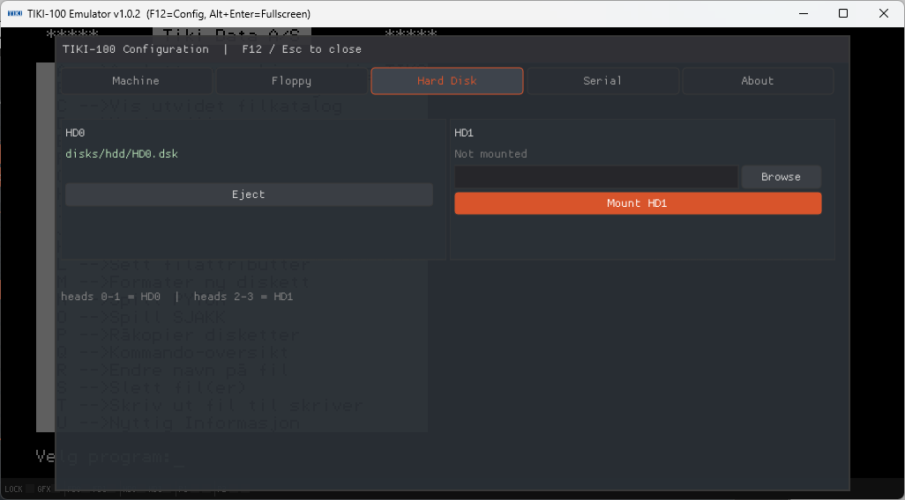
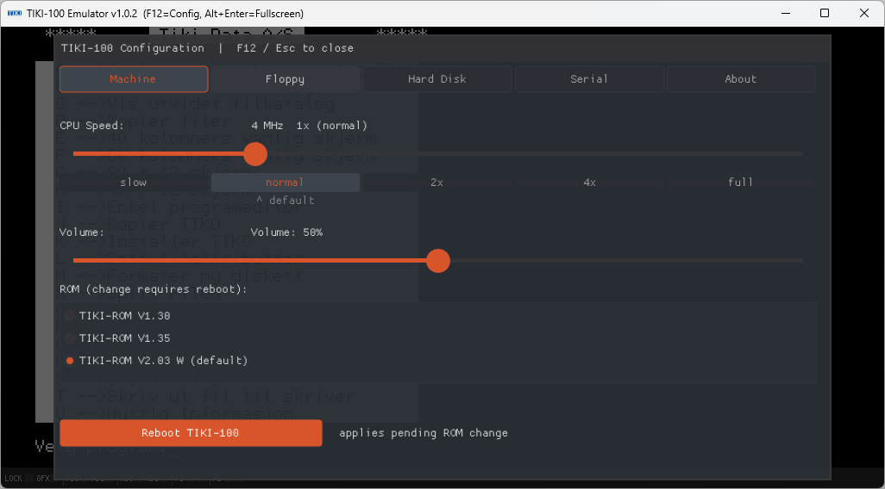
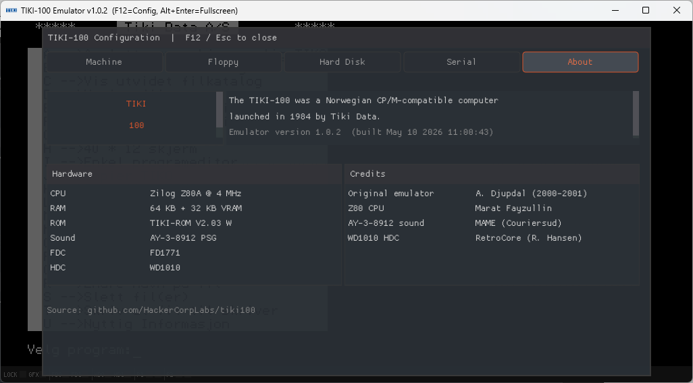
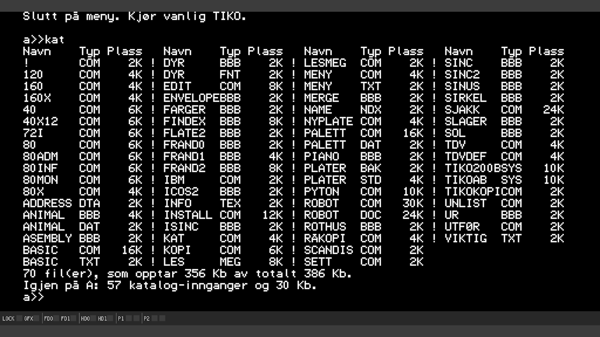
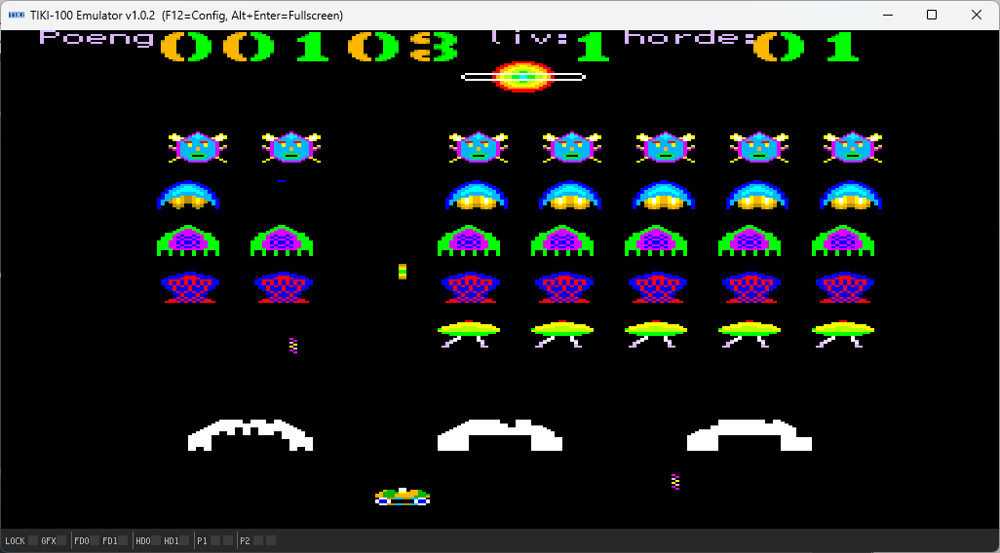
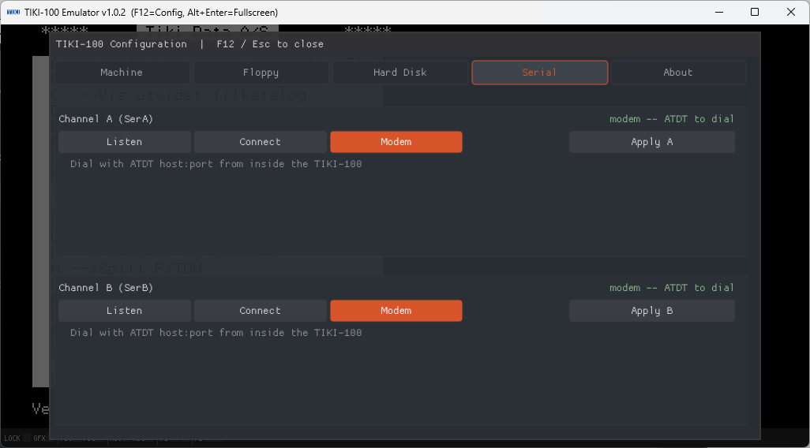

# TIKI-100 Emulator — User Manual

A friendly, step-by-step introduction to the TIKI-100 emulator. No prior
experience with emulators or 1980s computers is required — every term
and step is explained when it first appears.

If you are in a hurry, jump to **[4. Quick start guide](#4-quick-start-guide)**.
Otherwise, read straight through.

> **Where this manual fits:** the project also has focused reference
> documents — [INSTALL.md](INSTALL.md), [USAGE.md](USAGE.md),
> [MENU.md](MENU.md), [SERIAL.md](SERIAL.md), [HARDWARE.md](HARDWARE.md),
> [CREDITS.md](CREDITS.md). This manual brings their content together
> as a beginner-friendly walkthrough.

---

## Table of contents

1. [Introduction](#1-introduction)
2. [Installing the emulator](#2-installing-the-emulator)
3. [First start](#3-first-start)
4. [Quick start guide](#4-quick-start-guide)
5. [Understanding disk images](#5-understanding-disk-images)
6. [Keyboard and input](#6-keyboard-and-input)
7. [Emulator features](#7-emulator-features)
8. [Common software](#8-common-software)
9. [Troubleshooting](#9-troubleshooting)
10. [Advanced usage](#10-advanced-usage)
11. [FAQ](#11-faq)
12. [Glossary](#12-glossary)
13. [Additional resources](#13-additional-resources)

---

## 1. Introduction

### What was the TIKI-100?

The **TIKI-100** was a Norwegian home and school computer launched in
1984 by **Tiki Data A/S** (Oslo). It was built around the **Zilog Z80A**
processor running at 4 MHz — the same family of CPU that powered the
Sinclair ZX Spectrum, Amstrad CPC, and many CP/M business machines of
the same era.

What made the TIKI-100 stand out:

- **CP/M compatibility.** Its operating system, **TIKO/KP/M**, ran the
  same software as Digital Research's CP/M — meaning thousands of
  business and educational programs from across the world ran on it
  unchanged.
- **High-resolution graphics for its time** — up to 1024×256 pixels in
  two colours, plus medium and low-res colour modes.
- **Three-voice sound** via a General Instrument AY-3-8912 chip.
- **Adopted by Norwegian schools** after winning a major government
  tender in 1984, putting it on the desks of a generation of pupils.

It was originally called the *Kontiki 100* but renamed in 1984 after a
naming dispute with explorer Thor Heyerdahl.

### What does the emulator do?

An **emulator** is a program that pretends to be a different computer.
The TIKI-100 emulator runs on a modern PC (Windows, Linux, macOS, or a
Raspberry Pi) and behaves as if it were a real TIKI-100 from 1984. It
runs the same ROM, the same operating system, and the same software,
but inside a window on your modern desktop.

In practical terms, the emulator gives you:

- A full TIKI-100 system, including CPU, memory, video, sound, two
  floppy drives, two hard disks, two serial ports, and a printer port.
- The ability to load original disk images (`.dsk` files) and run
  authentic 1984 software.
- Modern conveniences like adjustable speed, save-and-load by file, an
  on-screen configuration menu, and TCP networking on the emulated
  serial ports (so you can dial real BBS-style services using the
  emulated Hayes modem).

### Why use the emulator today?

- **Preservation.** Real TIKI-100 hardware is rare and ageing. The
  emulator keeps the platform alive.
- **Education.** Norwegian schoolchildren of the 1980s grew up with
  this machine. It is a piece of national computing history.
- **Software exploration.** Run TIKI-BAS, Tiki-Kalk, BRUM, WordStar,
  SuperCalc, dBase II, Turbo Pascal, and countless other CP/M classics.
- **Programming.** Z80 assembly, BASIC, Pascal, and C are all
  accessible through period-authentic toolchains.
- **Curiosity.** It is a small, self-contained 8-bit world you can
  explore from scratch in an afternoon.



---

## 2. Installing the emulator

This is a summary. The complete platform-by-platform reference is in
[INSTALL.md](INSTALL.md).

### 2.1 Windows

1. Visit the project's **Releases page** on GitHub.
2. Download `tiki100-windows-x64.zip` (modern 64-bit Windows) or
   `tiki100-windows-x86.zip` (32-bit).
3. Right-click the ZIP, choose **Extract All…**, and pick a folder
   (your desktop, `C:\Tools\tiki100\`, or a USB stick — anywhere works).
4. Open the extracted folder and double-click `tiki100.exe`.

> **Important — keep `SDL2.dll` next to `tiki100.exe`.** The release
> ZIP already has the right layout. If you copy the EXE somewhere else
> on its own, Windows will fail with *"SDL2.dll was not found"*. Copy
> the **whole folder**, not just the EXE.

### 2.2 Linux and Raspberry Pi

The easiest path on any Debian-based distribution (Debian, Ubuntu, Mint,
Pop!_OS, **Raspberry Pi OS**) is the one-line installer:

```bash
curl -fsSL https://raw.githubusercontent.com/HackerCorpLabs/tiki100/main/scripts/install.sh | sh
```

After it finishes, run:

```bash
tiki100 -fd0 /usr/share/tiki100/disks/boot/tiko_kjerne_v4.01.dsk
```

Prefer not to pipe a shell script? Download the `.deb` for your
architecture from the Releases page and install it manually — see
[INSTALL.md](INSTALL.md#linux--raspberry-pi--direct-deb-download).

### 2.3 macOS (Apple Silicon)

1. Install SDL2 if you don't have it: `brew install sdl2`
2. Download `tiki100-macos-arm64.tar.gz` from the Releases page.
3. Extract and run:

   ```bash
   tar xzf tiki100-macos-arm64.tar.gz
   cd tiki100-macos-arm64
   xattr -d com.apple.quarantine tiki100   # bypass Gatekeeper warning
   ./tiki100 -fd0 disks/boot/tiko_kjerne_v4.01.dsk
   ```

The `xattr` line is needed because the binary is not currently signed
with an Apple Developer certificate.

### 2.4 What's included

When you install, you get:

| File / folder | Purpose |
|--|--|
| `tiki100` (or `tiki100.exe`) | The emulator program itself |
| `SDL2.dll` (Windows only) | Graphics, sound, input library |
| `rom/` | The TIKI-100 system ROMs (V1.30, V1.35, V2.03 W) |
| `disks/boot/` | Bootable floppy images, including the standard `tiko_kjerne_v4.01.dsk` system disk |

### 2.5 ROMs and legal considerations

The TIKI-100 system ROMs are bundled with the emulator and are **not
copyrighted in a way that restricts redistribution** for this project.
Original software (games, applications, etc.) on disk images may have
its own copyright status — please respect the wishes of the original
authors when downloading or sharing disks.

---

## 3. First start

### 3.1 Launching the emulator

The simplest possible launch is to start the emulator with a floppy
disk already inserted in drive 0:

**Windows (double-click)**: open the install folder and double-click
`tiki100.exe`. The default boot disk is loaded automatically.

**Windows (command prompt)**:
```cmd
cd path\to\tiki100
tiki100.exe -fd0 disks\boot\tiko_kjerne_v4.01.dsk
```

**Linux / Raspberry Pi**:
```bash
tiki100 -fd0 /usr/share/tiki100/disks/boot/tiko_kjerne_v4.01.dsk
```

**macOS**:
```bash
./tiki100 -fd0 disks/boot/tiko_kjerne_v4.01.dsk
```

After a moment, the emulator window appears, and the TIKI-100 boot
screen shows up.


### 3.2 Understanding the main window

The window is divided into two regions:

```
+------------------------------------------+
|                                          |
|    Emulated TIKI-100 screen              |
|    (text or graphics)                    |
|                                          |
+------------------------------------------+
|  LOCK  GFX  FD0  FD1  HD0  HD1  | P1 P2  |   <- status bar
+------------------------------------------+
```

- **Top area**: the TIKI-100's video output. Text mode characters,
  game graphics, BASIC prompts — all rendered here.
- **Bottom strip**: a status bar with small LEDs that mirror what the
  real machine would show. Hover the mouse over any LED for a tooltip
  in the window's title bar.



The LEDs are explained in detail in [section 7.5](#75-status-bar-leds-in-detail).

### 3.3 Controls at a glance

| Action | Key / control |
|--|--|
| Type into the TIKI-100 | Just use your keyboard |
| Open the emulator's configuration menu | **F12** |
| Close the menu | **F12** or **Esc** (caution — Esc is also a TIKI-100 key) |
| Toggle fullscreen | **Alt + Enter** |
| Quit the emulator | Close the window |

The mouse is only used inside the F12 configuration menu. The TIKI-100
itself was a keyboard-driven machine and the emulator does not pass
mouse events to it.

---

## 4. Quick start guide

For users who want to be running software in five minutes.

### Step 1 — Boot the emulator

Run the emulator with the bundled boot floppy:

```bash
tiki100 -fd0 disks/boot/tiko_kjerne_v4.01.dsk
```

You will see the TIKI-100 sign-on, then the operating system prompt.


### Step 2 — Mount a different disk

1. Press **F12**. The configuration overlay appears.
2. Click the **Floppy** tab at the top.
3. The list in the middle is the **disk catalogue** — every disk image
   the emulator knows about. Type in the **Filter** box to narrow the
   list, e.g. type `bas` to find BASIC-related disks.
4. Click a row to select it.
5. Click **Mount to FD0** (or **Swap into FD0** if a disk was already
   mounted) at the bottom right.


### Step 3 — Use the disk

1. Press **F12** to close the menu.
2. Inside the TIKI-100, type the appropriate command for whatever's on
   the disk — for many CP/M disks, that's the program name (e.g.
   `WS` for WordStar, `BRUM`, etc.).
3. Press **Enter**.

If the disk is bootable, you may need to reboot the machine: press
**F12 → Machine tab → Reboot TIKI-100**.

### Step 4 — Save your work

Saving works the way it does on the real TIKI-100: through the
operating system or application running inside the emulator (e.g.
`SAVE "FILENAME"` in BASIC). The data is written to the **disk image
file** on your host machine — the `.dsk` file you mounted. Close the
emulator and the file is automatically updated with any changes.

> **Tip — keep originals.** Make a copy of any `.dsk` you care about
> before mounting it, so you can roll back if something goes wrong.

---

## 5. Understanding disk images

### 5.1 What is a disk image?

A **disk image** is a single file that contains a byte-for-byte copy of
a real floppy disk or hard disk. The TIKI-100 emulator reads from and
writes to these files exactly as the real machine would read from real
disks. The most common file extension is `.dsk`.

Two kinds of storage are emulated:

| Type | Hardware emulated | Image size | File pattern |
|--|--|--|--|
| Floppy | FD1771 controller, 2 drives | 90 KB to 800 KB per disk | `.dsk` |
| Hard disk | WD1010 controller, 2 drives | 8 MB per drive | `.dsk` (typically `HD0.dsk`, `HD1.dsk`) |

### 5.2 Drive naming

The emulator exposes drives by their **physical slot**:

- **FD0**, **FD1** — the two floppy drives.
- **HD0**, **HD1** — the two hard disk drives.

The TIKI-100 operating system then assigns logical drive letters
(`A:`, `B:`, etc.) to whichever drives are present. So mounting an
image to "FD0" is the physical operation; what drive letter the OS
gives it depends on the OS configuration.

### 5.3 Mounting and ejecting disks

There are two ways to put a disk into a drive.

**At launch**, on the command line:
```bash
tiki100 -fd0 mygame.dsk -fd1 utils.dsk -hd0 HD0.dsk -hd1 HD1.dsk
```

**At runtime**, through the F12 menu:
1. Press **F12**.
2. Click the **Floppy** or **Hard Disk** tab.
3. Either pick from the **Catalog** (a curated list bundled with the
   emulator) or switch to **File path** and browse to a `.dsk` file
   anywhere on your computer.
4. Click **Mount**.

To **eject**, open the menu, find the drive card, and click **Eject**.





### 5.4 Where to find disk images

- The **`disks/`** folder bundled with the emulator contains a
  curated catalogue of period software.
- Online TIKI-100 archives (search for "TIKI-100 disk archive").
- Archives of CP/M software work too, since the TIKI-100 ran CP/M
  programs — but you may need a CP/M-compatible boot disk in FD0 first.

---

## 6. Keyboard and input

### 6.1 Direct keys

Most letter, number, and punctuation keys map directly. Just type and
the characters appear, exactly as they would on the real TIKI-100.

### 6.2 Special TIKI-100 keys

The TIKI-100 keyboard has a few keys with no obvious modern equivalent:

| Press on your PC | TIKI-100 key | What it does |
|--|--|--|
| **Esc** | ESC (which on the real machine was **CTRL+Æ**) | Sends the ESC code |
| **F10** or **Pause** | BRYT | Break key — interrupts the running program |
| **Backspace** or **Delete** | SLETT | Delete character |
| **F8** | GRAFIKK | Toggles graphics mode |

> **Why isn't Esc on the real keyboard?** The original TIKI-100
> keyboard simply did not have an ESC key — instead, the manual
> documented **CTRL + Æ** as the ESC sequence. The emulator translates
> your modern Esc key into that combination automatically.

### 6.3 Emulator-level shortcuts

These shortcuts are handled by the emulator itself and are **not** sent
to the TIKI-100:

| Shortcut | What it does |
|--|--|
| **F12** | Open the configuration overlay (see [section 7.1](#71-configuration-overlay-f12-menu)) |
| **Esc** (when overlay is open) | Close the overlay |
| **Alt + Enter** | Toggle fullscreen |

---

## 7. Emulator features

### 7.1 Configuration overlay (F12 menu)

Press **F12** at any time to pause the emulation and open the on-screen
configuration overlay. It has five tabs:

- **Machine** — CPU speed, volume, ROM selection, soft reset.
- **Floppy** — Mount/eject floppy disks; pick from a catalog or browse.
- **Hard Disk** — Mount/eject 8 MB hard disk images.
- **Serial** — Configure the two emulated serial ports.
- **About** — Version and credits.





Every control on every tab is documented in detail in
[MENU.md](MENU.md). The most common things you'll touch are
covered below.

### 7.2 Speed control

In the **Machine** tab the CPU speed slider has five stops:

| Setting | Equivalent CPU clock | Use when |
|--|--|--|
| `slow` | 2 MHz | You want to slow things down to read scrolling text |
| `normal` | 4 MHz (default — period-accurate) | Authentic experience |
| `2x` | 8 MHz | Speeds up long compiles or disk operations |
| `4x` | 16 MHz | Very fast — useful for tedious tasks |
| `full` | unthrottled | Runs as fast as your modern CPU allows; sound may stutter |

You can also change speeds by clicking any of the labels under the
slider (`slow`, `normal`, `2x`, `4x`, `full`). The active setting is
shown in orange.

### 7.3 Volume

Below the speed slider is a **Volume** slider (0% – 100%). It controls
the AY-3-8912 sound chip output. Drag the knob, click anywhere on the
track, or just leave it at the default 50%.

### 7.4 Reset (soft reboot)

In the **Machine** tab there is a **Reboot TIKI-100** button. This
performs a soft reset of the Z80 — equivalent to pressing the reset
switch on the real machine. It is needed:

- After changing the active ROM.
- If the running OS hangs.
- To boot from a different floppy without quitting the emulator.

> **Note:** Reset does **not** unmount disks. Whatever is mounted in
> FD0/FD1/HD0/HD1 stays put across the reboot.

### 7.5 Status bar LEDs in detail

The status bar at the bottom of the window mirrors the real TIKI-100's
front-panel indicators, plus extras for the emulated serial ports.


**System LEDs (left group):**

| LED | When lit |
|--|--|
| **LOCK** (green) | Caps Lock is active |
| **GFX** (cyan) | Graphics mode is enabled (video RAM mapped into Z80 address space) |
| **FD0** (yellow) | Floppy drive 0 is currently selected and active |
| **FD1** (yellow) | Floppy drive 1 is currently selected and active |
| **HD0** (green) | Hard disk 0 is being accessed (stays lit briefly after each access) |
| **HD1** (green) | Hard disk 1 is being accessed (stays lit briefly after each access) |

**Serial LEDs (right of the `|` separator):**

| LED | Meaning |
|--|--|
| **P1 TX** (orange) | Serial channel A transmitted a byte |
| **P1 RX** (cyan) | Serial channel A received a byte |
| **P2 TX** (orange) | Serial channel B transmitted a byte |
| **P2 RX** (cyan) | Serial channel B received a byte |

LEDs flash for ~150 ms after each byte. Hover your mouse over a LED to
see a tooltip in the title bar.

### 7.6 Fullscreen

Press **Alt + Enter** to toggle borderless fullscreen mode. Press it
again to return to a window.



### 7.7 Audio

Audio comes out of your default system audio device automatically.
There is no input/device selector inside the emulator — if you need to
route audio to a specific device, use your operating system's normal
audio routing (System Settings on macOS, Sound on Windows, PulseAudio /
PipeWire on Linux).

### 7.8 Persistence

Persistence is handled the way it was on the real machine — by saving
files to a mounted disk image. The disk image is written back to the
host filesystem when you save inside the running OS, so your work
survives quitting and re-launching.

---

## 8. Common software

The TIKI-100 ran a wide mix of native Norwegian software and
international CP/M titles. The list below is a starting point, not
exhaustive.

### 8.1 Operating systems

- **TIKO/KP/M** — The native operating system. CP/M-compatible. This
  is what boots from `tiko_kjerne_v4.01.dsk`.

### 8.2 Programming languages

- **TIKI-BAS** — Native BASIC interpreter, similar in feel to other
  early-1980s BASICs.
- **Turbo Pascal 3.0** — A classic Pascal compiler that was hugely
  popular under CP/M.
- **Microsoft BASIC, FORTRAN, COBOL** — All available in CP/M form.
- **Z80 assembler** (M80/L80, ASM/HEX, etc.) — Period-authentic
  assembly toolchains.

### 8.3 Productivity

- **WordStar** — The dominant CP/M word processor of the era.
- **SuperCalc** — Spreadsheet (the CP/M equivalent of VisiCalc).
- **dBase II** — Database.
- **Tiki-Kalk** — Native TIKI-100 spreadsheet.

### 8.4 Educational and Norwegian-specific

- **BRUM** — A native TIKI-100 learning environment used in Norwegian
  schools.
- Numerous teacher-authored programs from the Norwegian school project.

### 8.5 Games

A range of CP/M games (text adventures, simple action games, puzzles)
will run. The TIKI-100 was primarily a serious productivity machine,
so the games library is smaller than for, say, the ZX Spectrum.



---

## 9. Troubleshooting

### 9.1 The emulator will not start

**Windows: "SDL2.dll was not found"**
The `tiki100.exe` was moved away from `SDL2.dll`. Either move it back,
or copy `SDL2.dll` next to wherever the EXE now lives.

**macOS: "tiki100 cannot be opened because the developer cannot be verified"**
The binary is unsigned. Either right-click → **Open** in Finder once,
or run `xattr -d com.apple.quarantine tiki100` in Terminal.

**macOS: "dyld: Library not loaded"**
SDL2 is not installed. Run `brew install sdl2`.

**Linux: "command not found"**
After a `.deb` install, `tiki100` should be on your PATH automatically.
Try opening a fresh terminal, or call it explicitly: `/usr/bin/tiki100`.

### 9.2 Black or empty screen

- **No `-fd0` flag:** the emulator started without a boot disk. Quit
  and re-launch with a floppy image (see
  [section 4](#4-quick-start-guide)).
- **Headless Raspberry Pi**: install a graphical desktop or boot into
  one. SSH alone is not enough.
- **Stuck during boot**: try the Reboot button in F12 → Machine tab.

### 9.3 Keyboard problems

- **F-keys do nothing** — make sure your operating system isn't
  intercepting them (e.g. the Mac touch bar or a laptop's "Fn" lock).
- **Esc closes the menu instead of being sent to the TIKI-100** — yes,
  this is intentional when the F12 menu is open. Close the menu first,
  then press Esc.

### 9.4 Disk errors

- **"Disk full" inside the OS** — the emulated disk image really is
  full. Delete files inside the OS, or mount a fresh blank image.
- **Changes are lost after quitting** — make sure you saved inside the
  running program before quitting. The emulator does not auto-save
  RAM contents.
- **"File not found"** when mounting — double-check the path and that
  the file actually exists. Use the **Browse** button rather than
  typing the path manually.

### 9.5 Performance issues

- **Sound stutters or game runs too slow** — your host CPU may be
  struggling. On a Raspberry Pi Zero 2 / Pi 2, try the `-fast` flag,
  or set the Speed slider to **full**.
- **Game runs too fast** — set Speed to **normal** (the default).
  Modern CPUs are far faster than 4 MHz Z80s, so without throttling
  the emulator runs much faster than the real machine.

### 9.6 The F12 menu is small in the corner when the window is maximized

Known cosmetic issue. The menu stays at its native size in the
top-left while the rest of the window is dimmed. All buttons remain
clickable; they're just not visually scaled up. See
[MENU.md — Known issues](MENU.md#known-issues).

---

## 10. Advanced usage

### 10.1 Command-line flags

The full reference is in [USAGE.md](USAGE.md). Quick summary:

```
tiki100 [options]

  -fd0 <file>      Mount floppy image in FD0
  -fd1 <file>      Mount floppy image in FD1
  -hd0 <file>      Mount hard disk image in HD0
  -hd1 <file>      Mount hard disk image in HD1
  -scale <1-4>     Initial window scale (1 = native, 2 = 2x, etc.)
  -fast            Run at full speed (no throttle, sound may drift)
  -sera <mode>     Configure serial channel A (modem | listen:PORT | connect:HOST:PORT)
  -serb <mode>     Configure serial channel B
  -h, --help       Show help
```

Examples:

```bash
# Boot floppy + 2 hard disks
tiki100 -fd0 disks/boot/tiko_kjerne_v4.01.dsk -hd0 HD0.dsk -hd1 HD1.dsk

# Larger window
tiki100 -scale 2 -fd0 boot.dsk

# Channel A listens on TCP 5000 for incoming connections
tiki100 -sera listen:5000 -fd0 boot.dsk
```

### 10.2 Custom ROMs

The emulator ships with three ROMs:

| File | Label |
|--|--|
| `tikirom-1.30` | TIKI-ROM V1.30 |
| `tikirom-1.35` | TIKI-ROM V1.35 |
| `tikirom-2.03w` | TIKI-ROM V2.03 W *(default)* |

To add another ROM:

1. Drop the binary file into the `rom/` folder (8 KB, raw binary).
2. Edit `rom/roms.json` and add an entry, e.g.:
   ```json
   {"file": "my-custom-rom", "label": "My Custom ROM"}
   ```
3. Restart the emulator.
4. Open F12 → Machine tab and pick your new ROM in the list.
5. Click **Reboot TIKI-100** to load it.

### 10.3 Custom disk catalog

The Floppy tab's Catalog is read from `disks/disks.json`. You can edit
this file to add your own disks to the menu. The format is
self-documenting — open the existing file in a text editor.

### 10.4 Serial ports — TCP networking

Each serial port can be set to one of three modes (in the F12 menu's
Serial tab, or with `-sera` / `-serb` on the command line):

- **Modem** *(default)* — Hayes-compatible. Dial out from a TIKI-100
  terminal program with `ATDT host:port`. Lets you connect to BBSes,
  echo servers, or other TIKI-100s over the internet.
- **Listen** — TCP server. Bind a local port; the next incoming
  connection is forwarded straight to the DART chip. Useful for
  hosting your own service.
- **Connect** — TCP client. Permanently connected to a fixed host:port,
  with auto-reconnect. Useful for a dedicated link.



The full reference (including the entire AT command set) is in
[SERIAL.md](SERIAL.md).

### 10.5 Hardware emulation details

For developers, hardware hackers, or the curious, the I/O port map and
chip-level behaviour are documented in [HARDWARE.md](HARDWARE.md).
Highlights:

- Z80A CPU at 4 MHz
- 64 KB main RAM + 32 KB graphics RAM
- 8 KB monitor ROM at `0xF000–0xFFFF` (when ROM-enabled)
- Three video modes (1024×256/2-col, 512×256/4-col, 256×256/16-col)
- AY-3-8912 PSG (3 tone + noise + envelope)
- FD1771 floppy controller (2 drives)
- WD1010 hard disk controller (2 × 8 MB drives)
- Z80 DART (2 serial channels), Z80 PIO (parallel/printer), Z80 CTC
  (4-channel timer)

---

## 11. FAQ

**Q: Is the emulator free?**
Yes. The source is open and the pre-built binaries are free downloads.
See [CREDITS.md](CREDITS.md) for the per-component licenses.

**Q: Does it run real TIKI-100 software?**
Yes — that is the entire point. Original `.dsk` images boot and run
unmodified.

**Q: Will my saved work survive quitting?**
Yes, provided you saved inside the running OS to a mounted disk. The
disk image file on your host is updated as you save.

**Q: Can I run CP/M programs that didn't ship for TIKI-100?**
Yes, in many cases. Boot a CP/M-compatible disk in FD0, then mount the
program's disk in FD1 and access it with the appropriate drive letter.

**Q: Is there a Mac Intel build?**
The published macOS build is **arm64 only** (Apple Silicon).

**Q: How do I uninstall?**
- **Windows:** delete the extracted folder.
- **Linux/Pi:** `sudo apt remove tiki100`.
- **macOS:** delete the extracted folder and (optionally)
  `brew uninstall sdl2`.

---

## 12. Glossary

**Z80 / Z80A** — The 8-bit CPU at the heart of the TIKI-100, made by
Zilog and released in 1976. Hugely influential in 1980s computing.

**CP/M** — *Control Program for Microcomputers.* The dominant operating
system for 8-bit business computers before MS-DOS took over. The TIKI-100's
TIKO/KP/M is a compatible variant.

**ROM** — *Read-Only Memory.* A chip containing the system firmware
(monitor, boot routines). Can't be changed by the running computer.

**RAM** — *Random Access Memory.* Working memory, lost when the power
goes off (or when you quit the emulator without saving).

**Floppy disk image / `.dsk` file** — A single file on your modern
computer that contains all the bytes that would have been on a real
floppy disk. The emulator treats it exactly as if it were a floppy
inserted in a drive.

**Mount / Unmount (Eject)** — "Mount" means tell the emulator that a
particular disk image is now in a particular drive slot. "Unmount" or
"Eject" reverses this.

**FD0 / FD1** — The two **physical floppy drives** the emulator
exposes. The TIKI-100's OS may give them logical drive letters
internally.

**HD0 / HD1** — The two **physical hard disk drives**. Each can hold
an 8 MB image.

**Emulator** — A program that pretends to be different hardware. The
TIKI-100 emulator pretends to be a 1984 TIKI-100 on your modern PC.

**SDL2** — A library used by the emulator for the window, keyboard,
sound, and timing. On Windows it ships as `SDL2.dll` next to the EXE;
on Linux/macOS you install it separately.

**Hayes / AT commands** — A standard command set for controlling
modems, named after the company Hayes Microcomputer Products. The
emulator's serial channels can pretend to be a Hayes modem so software
that knows how to dial a real modem can dial out over TCP.

**BBS** — *Bulletin Board System.* Pre-internet text-based dial-in
services. Some BBSes are still online today and can be dialled with
the emulator's modem mode.

**DART / PIO / CTC** — Zilog support chips. DART = dual serial; PIO =
parallel I/O; CTC = counter/timer. All three are emulated.

**FD1771 / WD1010** — The Western Digital floppy and hard disk
controller chips that the TIKI-100 used. Both are emulated.

**AY-3-8912** — The General Instrument programmable sound generator
chip. Three tone channels, one noise channel, an envelope generator.
Used in many 1980s machines.

**Speed throttle** — Software that slows down the emulator so that one
emulated second equals one real second. With throttle off (`-fast` or
the **full** speed setting) the emulator runs as fast as your CPU
allows.

---

## 13. Additional resources

### Project documentation

- **[INSTALL.md](INSTALL.md)** — Installing pre-built binaries.
- **[USAGE.md](USAGE.md)** — Command-line flags, key reference,
  status LED reference.
- **[MENU.md](MENU.md)** — Every control in the F12 menu, in detail.
- **[SERIAL.md](SERIAL.md)** — TCP serial modes and the Hayes AT
  command set.
- **[HARDWARE.md](HARDWARE.md)** — Hardware emulated, I/O port map,
  source-tree layout.
- **[CREDITS.md](CREDITS.md)** — Acknowledgements and licenses.
- **[apple-dev.md](apple-dev.md)** — Notes on signing and notarizing
  the macOS build.

### About the original machine

- **Norsk Teknisk Museum** — historical pages on the TIKI-100 (in
  Norwegian).
- The Wikipedia entry for **TIKI-100** has a good summary in English.
- Period magazine archives (search for "Tiki Data" + the magazines of
  the era).

### Project on GitHub

- Issues, pull requests, and the full source code:
  `https://github.com/HackerCorpLabs/tiki100`
- Releases (pre-built binaries):
  `https://github.com/HackerCorpLabs/tiki100/releases`

### Acknowledgements

The emulator builds on the work of many people — original TIKI-100
emulator by Asbjorn Djupdal (2000–2001), Z80 CPU by Marat Fayzullin,
AY-3-8912 by the MAME team, WD1010 from RetroCore. Full credits in
[CREDITS.md](CREDITS.md).

---

**Full path of this document:**
`E:\Dev\Emulators\Z80\ronny-tiki100\docs\MANUAL.md`
